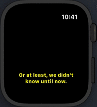

# SubtitlePlayer

Parse and play .srt subtitles in real-time

## Instructions

### Basics
1. Checkout repo
2. Add your OpenSubtitles User-Agent (https://trac.opensubtitles.org/projects/opensubtitles/wiki/DevReadFirst) on `main.swift` (not needed for playing previously downloaded files)
3. Run `swift build`

### Play file
To play using natural time, run:
```shell
swift run subt play file=/path/to/subtitle.srt
```

To play from when you hear the first dialog, run:
```shell
swift run subt play file=/path/to/subtitle.srt from-line=0
```

To play from a specific dialog (convenient for popcorn breaks), run:
```shell
swift run subt play file=/path/to/subtitle.srt from-line=42
```

To play using a specific encoding, run:
```shell
swift run subt play file=/path/to/subtitle.srt encoding=isoLatin1
```
(for a full list of supported encodings, please check: https://github.com/luizmb/SubtitlePlayer/blob/master/Sources/Common/StringEncoding%2BExtensions.swift)

### Search
To search a movie subtitles, run:
```shell
swift run subt search query=lord\ of\ the\ rings language=pob
```

To search a TV show subtitles, run:
```shell
swift run subt search query=game\ of\ thrones season=8 episode=2 language=pob
```

### Download
To download a subtitle file, run:
```shell
swift run subt download url=https://dl.opensubtitles.org/en/download/src-api/vrf-19b80c51/filead/1952845222.gz into=/Users/myuser/Downloads/got.srt
```

To download a subtitle file and play it immediately, run:
```shell
swift run subt download url=https://dl.opensubtitles.org/en/download/src-api/vrf-19b80c51/filead/1952845222.gz into=/Users/myuser/Downloads/got.srt play=true
```

### All Together
To search a TV show, pick the best match and play from certain dialog using some specific encoding, run:
```
swift run subt search query=game\ of\ thrones season=8 episode=2 language=pob play=0 from-line=3 encoding=isoLatin1
```

### iPhone, iPad, Apple Watch, Apple TV and Mac
This is work in progress.



## Disclaimer

Requires RxSwift and Swift 5

Framework should be able to run on iOS, macOS, watchOS, tvOS or Linux, however for now only the console app is implemented.